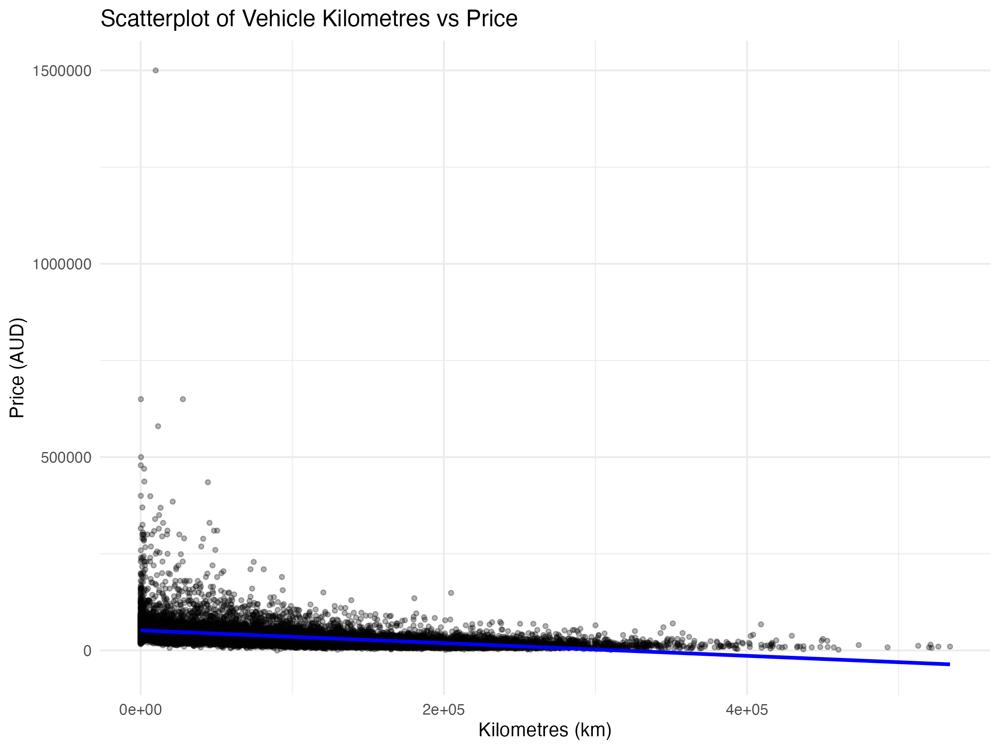
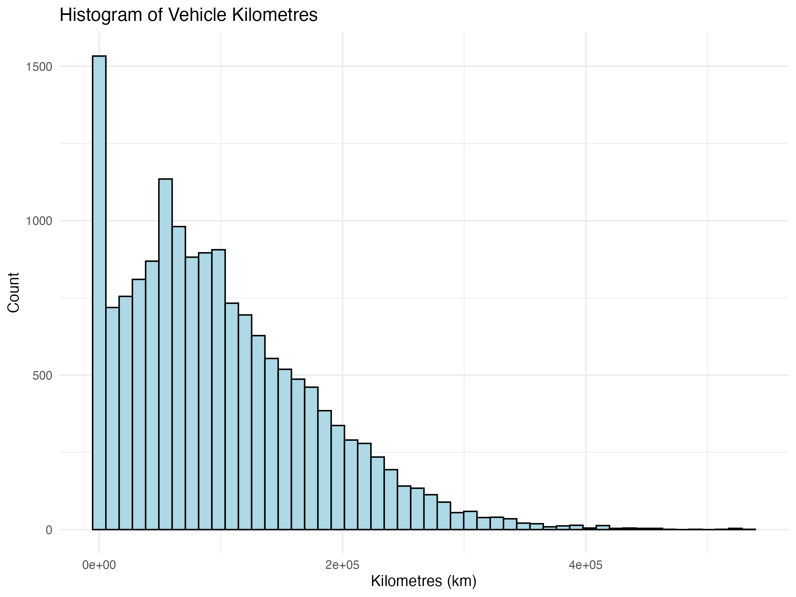

<h1 align="center" style="color:#FF6F61;">
🚗 Australian Vehicle Prices Dataset (ds314)
</h1>

A complete analysis of Australian vehicle resale prices using R 📊  

<h2 style="color:#FF6F61;">🔍 Research Question</h2>

<b>Research Question (RQ):</b> 
<i>“Is there a correlation between vehicle Kilometres and Price?”</i>

This question investigates whether vehicle usage, measured through odometer readings, 
has a statistically significant relationship with resale value in the Australian automotive market.
Understanding this relationship helps reveal real pricing trends and buyer behaviour.

<!-- Dataset Summary Card -->

<h2 style="color:#FF6F61;">📘 Dataset Summary</h2>

📌 <b>Total Rows:</b> 16,735 
📌 <b>Data Rows:</b> 16,734 
📌 <b>Header Rows:</b> 1 
📌 <b>Total Columns:</b> 19 (A → S) 

This dataset contains listings of vehicles sold in Australia, including  
brand, model, year, kilometres, engine details, body type, price, and more.

<!-- Column Table -->
<h2 style="color:#46C2CB;">📑 Column List (A → S)</h2>

<table>
<tr><th>Column</th><th>Name</th><th>Description</th></tr>
<tr><td>A</td><td>Brand</td><td>Manufacturer name</td></tr>
<tr><td>B</td><td>Year</td><td>Manufacturing year</td></tr>
<tr><td>C</td><td>Model</td><td>Model name</td></tr>
<tr><td>D</td><td>Car/Suv</td><td>Vehicle category</td></tr>
<tr><td>E</td><td>Title</td><td>Listing title</td></tr>
<tr><td>F</td><td>UsedOrNew</td><td>New / Demo / Used</td></tr>
<tr><td>G</td><td>Transmission</td><td>Auto / Manual</td></tr>
<tr><td>H</td><td>Engine</td><td>Engine size and type</td></tr>
<tr><td>I</td><td>DriveType</td><td>FWD / RWD / AWD</td></tr>
<tr><td>J</td><td>FuelType</td><td>Petrol / Diesel / Hybrid</td></tr>
<tr><td>K</td><td>FuelConsumption</td><td>L per 100km</td></tr>
<tr><td>L</td><td>Kilometres</td><td>Odometer reading</td></tr>
<tr><td>M</td><td>ColourExtInt</td><td>Exterior / Interior colours</td></tr>
<tr><td>N</td><td>Location</td><td>Dealer location</td></tr>
<tr><td>O</td><td>CylindersinEngine</td><td>Number of cylinders</td></tr>
<tr><td>P</td><td>BodyType</td><td>SUV / Sedan / Coupe / Hatchback</td></tr>
<tr><td>Q</td><td>Doors</td><td>Number of doors</td></tr>
<tr><td>R</td><td>Seats</td><td>Seating capacity</td></tr>
<tr><td>S</td><td>Price</td><td>Vehicle price (AUD)</td></tr>
</table>

<!-- Visualizations -->
<h2 style="color:#FFB200;">📊 Visualisations</h2>

Below are the key visualisations generated using R:

<h3>Scatterplot: Kilometres vs Price</h3>

<h3>Histogram: Distribution of Kilometres</h3>

<!-- Analysis Section -->
<h2 style="color:#B980F0;">📈 Statistical Analysis</h2>

We performed Pearson and Spearman correlation tests to examine whether  
vehicle kilometres are correlated with price.  
Results are saved in: <b><code>correlation-results.csv</code></b>

<!-- Purpose of Project -->
<h2 style="color:#00C9A7;">🎯 Project Purpose</h2>

<ul>
<li>Understand factors affecting Australian car resale pricing</li>
<li>Perform data cleaning and wrangling in R</li>
<li>Create meaningful visualisations</li>
<li>Conduct statistical hypothesis testing</li>
<li>Document findings and interpretations</li>
</ul>

<!-- Source -->
<h2 style="color:#E94560;">🔗 Dataset Source</h2>

Kaggle Link:  
<a href="https://www.kaggle.com/datasets/nelgiriyewithana/australian-vehicle-prices">
https://www.kaggle.com/datasets/nelgiriyewithana/australian-vehicle-prices
</a>

<!-- Footer -->

Made with ❤️ using <b>R</b> and <b>tidyverse</b>

